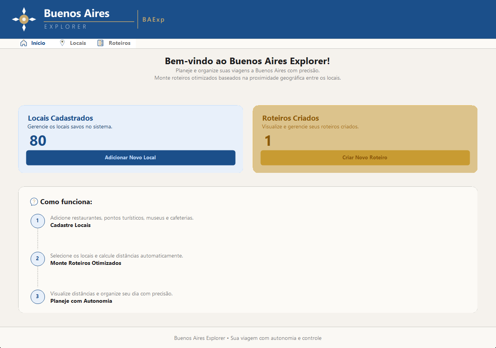
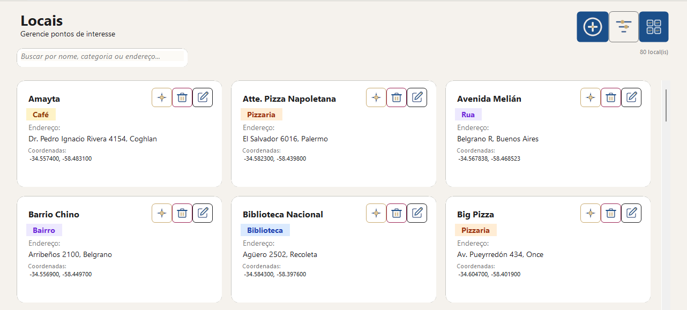
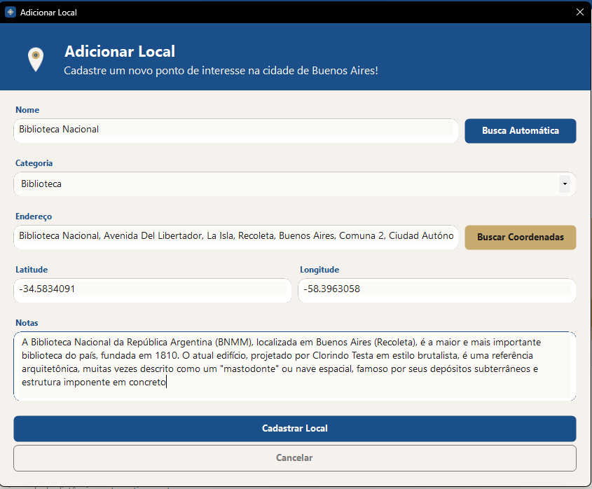
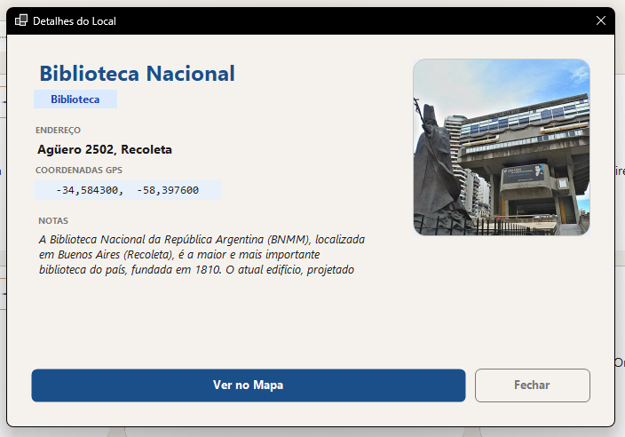
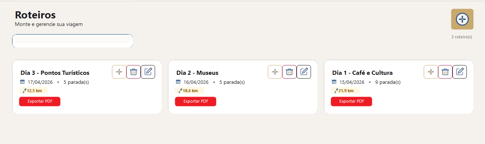
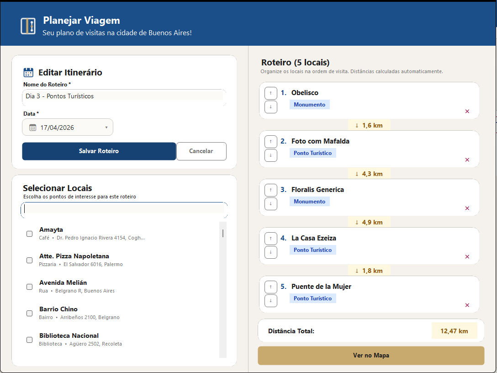
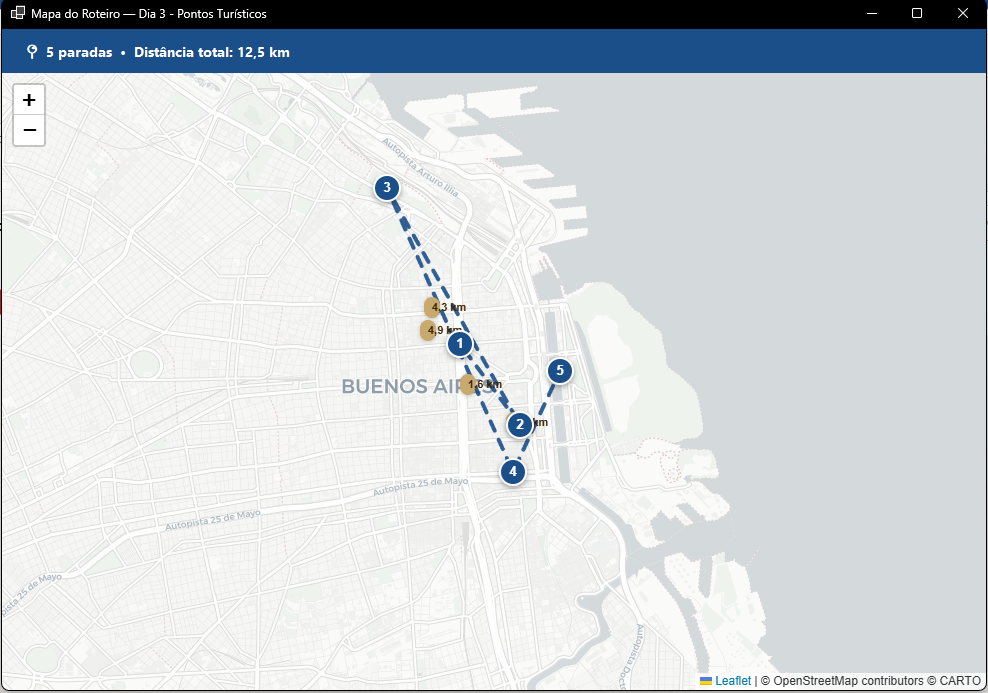

# Buenos Aires Explorer
<p align="left">
  
</p>

A desktop application built with C# and Windows Forms for organizing points of interest in Buenos Aires, with support for location registration, automatic coordinate lookup, Wikipedia image previews, distance calculation, and visit route planning.

> This project is under active development. Features and structure may change.

## Release
 
> **The first stable release is available!**
> Download the latest version directly from the [**Releases page**](https://github.com/dasilva-thiago/BuenosAiresExp/releases/tag/v1.0.0) — no installation required, just run the executable.
 
---

## Motivation

This project was created to explore desktop application development with C# and WinForms,
focusing on clean architecture, UI customization, and integration with external services
such as geocoding, map rendering, and image fetching. The main objective is to provide a simple yet powerful tool for users to plan their visits to Buenos Aires,
allowing them to register locations, create itineraries, and visualize routes on a map, all in a single application.

---

## Features

### Home

<p align="center">
  
</p>

- Summary of registered locations and itineraries
- Quick access buttons to create new locations and itineraries
- How To guide for first-time users

### Locations

<p align="center">
  
</p>

- Register and view points of interest with name, category, address, coordinates, and notes
- **Card** or **table** view with toggle
- Filter by category and search by name, category, or address
- Edit, delete, and view full details for each location

<p align="center">
  
</p>

- Automatic coordinate lookup via [Nominatim (OpenStreetMap)](https://nominatim.org/)
- Automatic Address lookup via coordinates (reverse geocoding)
- Standardized category selection with icons (e.g., Museum, Park, Restaurant) and option for custom categories

<p align="center">
  
</p>

- Automatic Wikipedia/Wikimedia image lookup based on location name and coordinates (geosearch + title fallback)
- Open any location directly in OpenStreetMap from the detail form
- Single card view for details with all information and image preview, no separate tabs

### Itineraries

<p align="center">
  
</p>

- View and manage visit itineraries with multiple stops, including distance calculation and map visualization
- Export itineraries to PDF with a clean, custom-designed layout via QuestPDF
- Manage itineraries with options to edit, delete, and view details for each itinerary

<p align="center">
  
</p>

- Create itineraries with a name and date
- Select and reorder stops with up/down controls

<p align="center">
  
</p>

- Automatic distance calculation between stops (Haversine formula)
- Interactive map view of the itinerary (Leaflet.js via WebView2)

### Interface
- Custom visual theme (`BuenosAiresTheme`) with a per-category color palette
- Custom UI components: `RoundedButton`, `RoundedTextBox`, `RoundedComboBox`, `RoundedPanel`, `RoundedDateTimePicker`, `StepBadge`, `TabLabel`
- Tab-based navigation: **Home**, **Locations**, and **Itineraries**
- Home screen with a summary of registered locations and itineraries

---

## Tech Stack

| Technology | Version |
|---|---|
| C# / .NET | 10 |
| Windows Forms | — |
| Entity Framework Core | 10.0.5 |
| SQLite | — |
| Microsoft.Web.WebView2 | 1.0.3856.49 |
| QuestPDF | 2026.2.4 |
| Leaflet.js (map) | 1.9.4 |
| Nominatim API (geocoding) | — |
| Wikimedia/Wikipedia API (images) | — |

---

## Project Structure

```
BuenosAiresExp/
├── Assets/               # UI icons and logo system
├── Data/
│   ├── AppDbContext.cs   # EF Core context (SQLite)
│   └── AppDbContextFactory.cs
├── Migrations/           # Database migrations
├── Models/
│   ├── Location.cs
│   ├── Itinerary.cs
│   └── ItineraryItem.cs
├── Services/
│   ├── LocationService.cs
│   ├── ItineraryService.cs
│   ├── DistanceService.cs
│   ├── GeocodingService.cs
│   ├── MapService.cs
│   ├── PdfService.cs
│   ├── PathHelper.cs
│   └── WikimediaImageService.cs
├── UI/
│   ├── BuenosAiresTheme.cs
│   ├── RoundedButton.cs
│   ├── RoundedTextBox.cs
│   ├── RoundedComboBox.cs
│   ├── RoundedPanel.cs
│   ├── RoundedDateTimePicker.cs
│   ├── StepBadge.cs
│   └── TabLabel.cs
└── Views/
    ├── HomeForm.cs
    ├── LocationForm.cs
    ├── LocationDetailForm.cs
    ├── LocationsView.cs
    ├── ItineraryForm.cs
    ├── ItineraryMapForm.cs
    └── RoteirosView.cs
```

---

## Database

The SQLite database (`buenos_aires.db`) is created automatically on first run via `Database.Migrate()`. The current schema includes three tables:

- **Locations** — points of interest (name, category, address, coordinates, notes)
- **Itineraries** — itineraries (name, date, notes)
- **ItineraryItems** — relationship between itineraries and locations, with visit order

---

## Getting Started

### Option 1 — Download the release (recommended)
 
Head to the [**Releases page**](https://github.com/dasilva-thiago/BuenosAiresExp/releases/tag/v1.0.0) and download the latest `.exe`. No installation needed.
 
### Option 2 — Build from source
 
1. Clone the repository
2. Open `BuenosAiresExp.slnx` in Visual Studio 2022+ (with the .NET 10 SDK installed)
3. Restore NuGet packages
4. Run the project (`F5`)
 
> The database file is created automatically in the output folder (`bin/`) on first launch.

---

## License

This project is licensed under the MIT License.
See [LICENSE.txt](LICENSE.txt) for details.